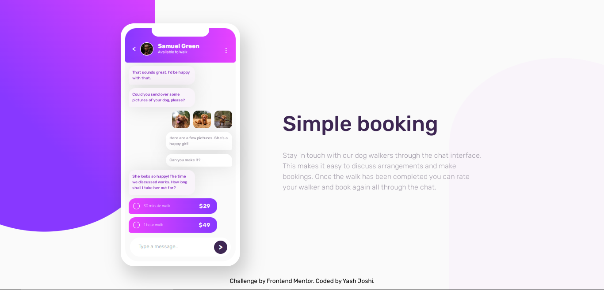

# Frontend Mentor - Chat app CSS illustration

This is a solution to the [Design preview for the Chat app CSS illustration coding challenge](./design/desktop-preview.jpg)

## Table of contents

- [Overview](#overview)
  - [The challenge](#the-challenge)
  - [Screenshot](#screenshot)
  - [Links](#links)
- [My process](#my-process)
  - [Built with](#built-with)

## Overview

**To do this challenge, you need a strong understanding of HTML and CSS.**

## The challenge

Users should be able to:

- View the optimal layout depending on their device's screen size.
- See hover and focus states for interactive elements.
- **Bonus**: See the chat interface animate on the initial load.

### Screenshot

### Links

- Solution URL: (https://github.com/yashgjoshi20/Order-Summary-Component-Using-CSS.git)
- Live Site URL: (https://yashgjoshi20.github.io/Order-Summary-Component-Using-CSS/)

## My process

- Worked on displaying cards as given in the design.
- Added media queries for smaller devices to show optimal layout to the user.
- Tried my hand at CSS animation to give the hover effect in the chat interface after initial load.

### Built with

- Semantic HTML5 markup
- CSS custom properties
- Flexbox
- CSS Grid
- Mobile-first workflow
- CSS Animation.

 ## Author

- GitHub - Yash Joshi (https://github.com/yashgjoshi20)
- Frontend Mentor - Yash Joshi (https://www.frontendmentor.io/profile/yashgjoshi20)