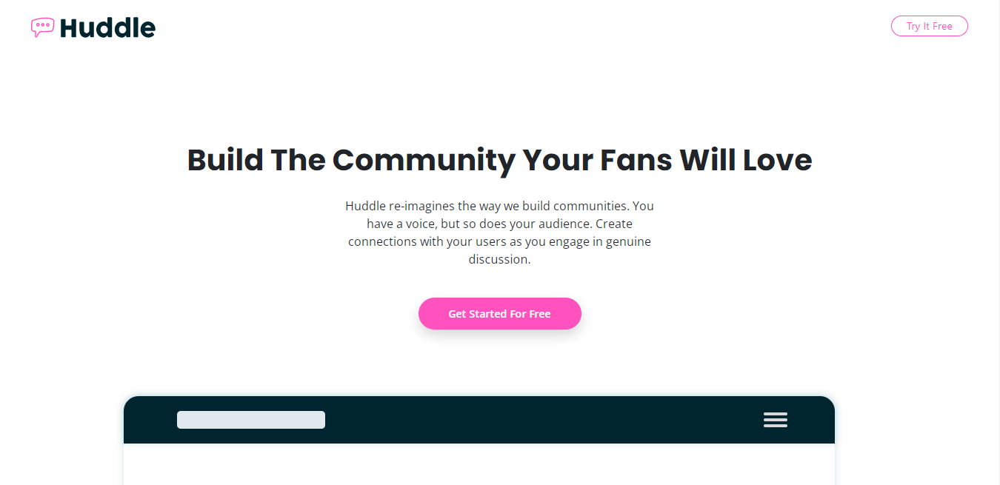
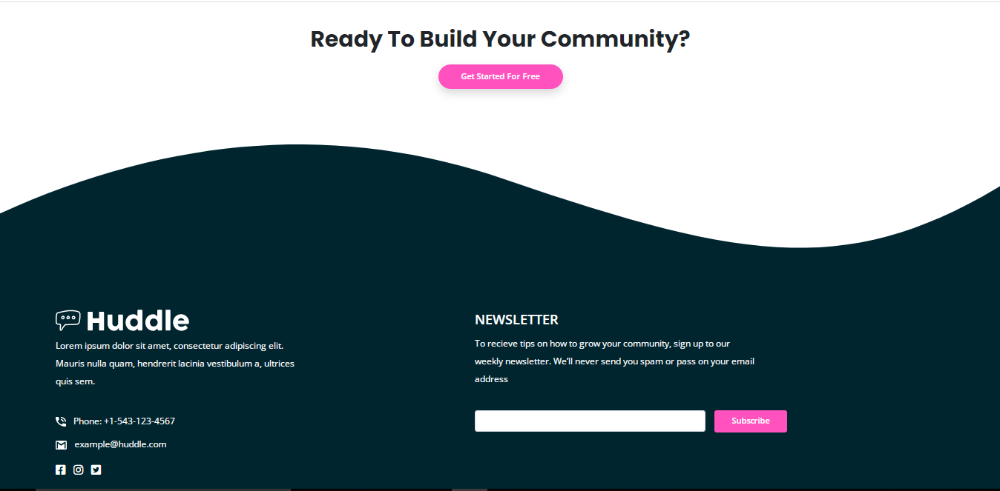

# Frontend Mentor - Huddle landing page with curved sections

This is a solution to the[Header/intro section for the Huddle landing page with curved sections](./design/desktop-preview.jpg)

## [📃💻 Website view 🖱🖥](https://)

## Table of contents

- [Overview](#overview)
  - [The challenge](#the-challenge)
  - [Screenshot](#screenshot)
  - [Links](#links)
- [My process](#my-process)
  - [Built with](#built-with)

## Overview

### The challenge

Users should be able to:

- View the optimal layout depending on their device's screen size
- See hover and focus states for interactive elements

### Screenshot

### Links

- Solution URL:  [Solution  URL](https://github.com/yashgjoshi20/Order-Summary-Component-Using-CSS.git)
- Live Site URL: [GitHub Pages Live URL](https://yashgjoshi20.github.io/Order-Summary-Component-Using-CSS/)

## My process

Worked on displaying cards as given in the design.
Added media queries for smaller devices to show optimal layout to the user.

### Built with

- Semantic HTML5 markup
- CSS custom properties
- Flexbox
- CSS Grid
- Mobile-first workflow

 ## Author

- GitHub - [Yash Joshi](https://github.com/yashgjoshi20)
- Frontend Mentor - [Yash Joshi](https://www.frontendmentor.io/profile/yashgjoshi20)